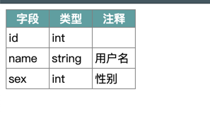
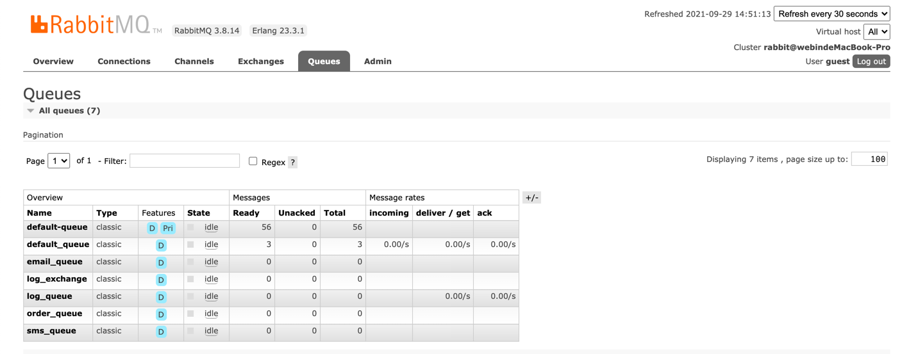

ThinkPHP 6.0
===============

> 运行环境要求PHP7.1+，兼容PHP8.0。
* step1:配置  mv .example.env .env
* step2:安装依赖 composer install
* step3:数据库迁移  php think migrate:run 

### 1.接口CURD

- 后端:
  - 控制器继承BaseApi 然后__construct(User $model) $model:需要查询的model
  - 返回字段注释文档(model可自动生成,往下看) xxx.com/api/doc?model=\app\common\model\User
  
- 前端:
- 1.列表
- 请求路径:index
- 请求方法:get
- 参数:page 页数
- limit 每页条数  不做分页传500
- filter 查询条件(所有查询字段可由前端自动组装,后端只需提供相关字段即可)

```
{
	"create_time":"2021-06-07 00:00:00 - 2021-06-07 23:59:59",
	"name":"测试",
	"id":1,
	"status":"1,2"
}
```
op 条件类型 属性值 =(精准查询), %*%(模糊搜索),RANGE(在范围),NOT RANGE(不在该范围),BETWEEN(区间查询)
```
{
	"create_time":"range",
	"name":"%*%",
	"id":"=",
	"status":"between"
}
```
参考:

`xxx.com/api/v1/test/index?page=1&limit=15&filter={"create_time":"2021-06-01 00:00:00 - 2021-06-07 23:59:59"}&op={"create_time":"range"}
`

排序: sort=id&order=desc

```
id : 排序字段  desc 倒序  asc 顺序
```

2.查看
- 请求路径:view
- 请求方法:get
- 参数:id
- 参考:   {{url}}/api/v1/test/view/1

3.删除
- 请求路径:delete
- 请求方法:delete
- 参数:id
- 参考:   {{url}}/api/v1/test/delete/1

### 2.队列
- 需安装rabbitMq
- 配置文件 config\rabbitmq.php

1.投递

- 参考: xxx.com/api/test-queue

2.消费(可加在Linux crontab 定时执行)
- 文件位置 \app\command\RunQueue
- php think run-queue default_queue(这个是队列名称,ctrl+c可结束进程)
- 

### 3.快速调试静态方法
- 文件位置 \app\command\RunStatic
- 执行静态方法 php think run-static 方法绝对路径 参数1 参数2 ...
- eg: php think run-static "\app\command\RunStatic::test" 1 2


### 4.自动生成model类
- 文件位置 \app\command\GiiModel
- 自动生成model类  php think gii-model test@user(test:文件夹 user:表名)
- 自动生成model类  php think gii-model user(user:表名)

### 5.日志相关
- api接口日志(需要在控制台执行消费php think run-queue log_queue) api_log
- 队列执行日志 queue_log
